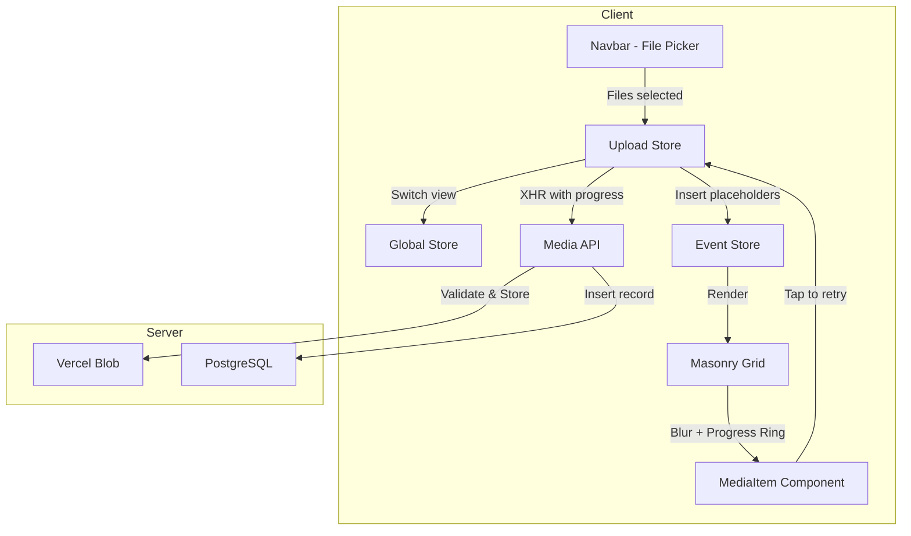
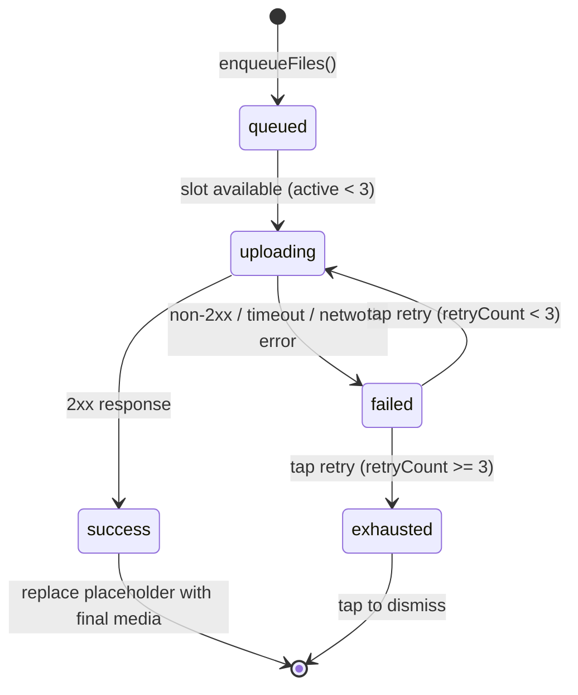

# Design Document: Upload Improvements

## Overview

This feature overhauls the upload experience in Golden Core, a mobile-first event photo-sharing application built with Next.js 16, Zustand for state management, and Vercel Blob for file storage. The current implementation supports single-file image upload via a hidden `<input type="file">` element in the Navbar component, with no progress feedback, no video support, and a full page reload after upload.

The new design introduces:
- Multi-file selection (up to 20 files) with concurrent upload processing (max 3 simultaneous)
- Video upload support (MP4, MOV, WEBM) alongside images, with a 100 MB limit
- Automatic navigation to the "My Photos" view with local placeholder thumbnails
- A blur overlay on uploading items with a circular progress ring showing real-time upload percentage
- Robust error handling with 30-second timeouts and tap-to-retry (up to 3 retries)

The solution is implemented entirely client-side for the upload orchestration (new `upload.store.ts`) while extending the existing Media API route for video support and file validation.

## Architecture



### Key Architecture Decisions

1. **XHR instead of fetch()** — The `fetch` API does not expose upload progress events. We use `XMLHttpRequest` with `upload.onprogress` to track bytes sent per file. This is wrapped in a promise-based utility for clean async/await usage.

2. **Dedicated Upload Store** — A new Zustand store (`upload.store.ts`) manages the upload queue, concurrency, progress tracking, and retry state. This keeps the upload logic decoupled from the existing `event.store.ts` which manages fetched event data.

3. **Local file previews via `URL.createObjectURL()`** — Instead of waiting for the server response, we generate a local object URL from the selected `File` to display an immediate thumbnail in the masonry grid. For videos, we extract a frame using a hidden `<video>` element and `<canvas>`.

4. **Concurrency control via semaphore pattern** — A simple counter-based approach processes at most 3 uploads simultaneously. When one completes (success or failure), the next enqueued item starts.

## Components and Interfaces

### New: `upload.store.ts` (Zustand Store)

```typescript
interface UploadItem {
  id: string;                    // Client-generated UUID
  file: File;                    // Original File object
  previewUrl: string;            // Object URL for local preview
  status: 'queued' | 'uploading' | 'success' | 'failed' | 'exhausted';
  progress: number;              // 0-100 integer percentage
  retryCount: number;            // 0-3
  error: string | null;          // Error message when failed
  mediaResult: Media | null;     // Server response on success
}

interface UploadStore {
  items: UploadItem[];
  activeCount: number;

  // Actions
  enqueueFiles: (files: File[], eventSlug: string) => void;
  retryItem: (id: string) => void;
  dismissItem: (id: string) => void;
  processQueue: () => void;
}
```

### Modified: `navbar.tsx`

- Change `<input>` to accept `image/*,video/mp4,video/quicktime,video/webm` with `multiple` attribute
- Add max-file validation (20 files) on the `onChange` handler
- On file confirmation: call `uploadStore.enqueueFiles(files, eventSlug)` and `globalStore.changeState('myPhotos')`

### Modified: `masonry.tsx`

- Accept an additional `uploadingItems: UploadItem[]` prop
- Render uploading items at the top of the grid before server-loaded media
- Each uploading item renders a `<MediaItemPlaceholder>` component

### New: `media-item-placeholder.tsx`

```typescript
interface MediaItemPlaceholderProps {
  item: UploadItem;
  onRetry: (id: string) => void;
  onDismiss: (id: string) => void;
}
```

- Displays `previewUrl` as `` (image) or `<video>` (video poster frame)
- Applies `filter: blur(10px)` while `status === 'uploading'`
- Overlays a circular `<svg>` progress ring showing `item.progress`
- Shows error icon when `status === 'failed'`
- Tap handler: retry if `retryCount < 3`, dismiss if `retryCount >= 3`
- On success: removes blur with 300ms CSS transition, shows final content

### Modified: `Media API route` (`app/api/event/[event-slug]/media/route.ts`)

- Add MIME type validation: accept `image/jpeg`, `image/png`, `image/webp`, `image/heic`, `video/mp4`, `video/quicktime`, `video/webm`
- Add file size validation: reject files > 100 MB with 400 status
- Add `media_type` field to the INSERT query (requires DB migration)
- Return `media_type` in the response

### New: `upload-xhr.ts` (Utility)

```typescript
interface UploadOptions {
  file: File;
  url: string;
  date: string;
  onProgress: (percent: number) => void;
  timeoutMs: number;  // 30000
}

function uploadFile(options: UploadOptions): Promise<Media>;
```

Wraps XHR in a Promise with:
- `upload.onprogress` callback for byte-level progress
- `timeout` property set to 30000ms
- Rejects on timeout, network error, or non-2xx status

### Modified: `image.tsx` → Renamed to `media-item.tsx`

- Conditionally renders `` or `<video>` based on media type
- Video elements include `controls`, `playsinline`, and `preload="metadata"` attributes

## Data Models

### Database Changes

```sql
-- Add media_type column to distinguish images from videos
ALTER TABLE public.media
  ADD COLUMN media_type VARCHAR(10) NOT NULL DEFAULT 'image';

-- Add constraint for valid types
ALTER TABLE public.media
  ADD CONSTRAINT media_type_check CHECK (media_type IN ('image', 'video'));
```

### Updated Media DTO

```typescript
export interface Media {
  media_id: number;
  user_id: number;
  content: string;       // Vercel Blob URL
  media_type: 'image' | 'video';  // NEW
  likes: number;
  liked: boolean;
  date: string;
  section_id: number | null;
}
```

### Upload Item (Client-Side Only)

```typescript
interface UploadItem {
  id: string;                    // crypto.randomUUID()
  file: File;
  previewUrl: string;            // URL.createObjectURL(file)
  status: 'queued' | 'uploading' | 'success' | 'failed' | 'exhausted';
  progress: number;              // 0–100
  retryCount: number;            // 0–3
  error: string | null;
  mediaResult: Media | null;
}
```

### Accepted File Types

| Category | MIME Types | Extensions |
|----------|-----------|------------|
| Image | `image/jpeg`, `image/png`, `image/webp`, `image/heic` | .jpg, .jpeg, .png, .webp, .heic |
| Video | `video/mp4`, `video/quicktime`, `video/webm` | .mp4, .mov, .webm |

### Constraints

| Constraint | Value |
|-----------|-------|
| Max files per selection | 20 |
| Max concurrent uploads | 3 |
| Max file size | 100 MB |
| Upload timeout | 30 seconds |
| Max retry attempts | 3 (4 total including original) |
| Blur radius | 10px |
| Blur removal transition | 300ms |


## Correctness Properties

*A property is a characteristic or behavior that should hold true across all valid executions of a system — essentially, a formal statement about what the system should do. Properties serve as the bridge between human-readable specifications and machine-verifiable correctness guarantees.*

### Property 1: File count validation

*For any* array of files with length between 1 and 20 (inclusive), the file count validation function SHALL accept the batch. *For any* array of files with length greater than 20, the validation function SHALL reject the batch. *For any* empty array, the validation function SHALL accept but take no action.

**Validates: Requirements 1.1, 1.4, 1.5**

### Property 2: Enqueue append semantics

*For any* existing upload queue of length M and *any* new file batch of length N (where 1 ≤ N ≤ 20), after enqueuing, the resulting queue SHALL have length M + N, the first M items SHALL be unchanged from the original queue, and items at indices M through M+N-1 SHALL correspond to the new files in their original selection order.

**Validates: Requirements 1.2, 3.4, 3.5**

### Property 3: Concurrency invariant

*For any* sequence of enqueue, upload-complete, and upload-fail events applied to the upload store, the number of items with status `'uploading'` SHALL never exceed 3 at any point in the sequence.

**Validates: Requirements 1.3**

### Property 4: MIME type validation

*For any* file with a MIME type in the set {`image/jpeg`, `image/png`, `image/webp`, `image/heic`, `video/mp4`, `video/quicktime`, `video/webm`}, the file type validation function SHALL accept the file. *For any* file with a MIME type NOT in this set, the validation function SHALL reject the file.

**Validates: Requirements 2.1, 2.4**

### Property 5: Media type classification

*For any* accepted file, if its MIME type starts with `video/`, the resulting media record SHALL have `media_type = 'video'`. If its MIME type starts with `image/`, the resulting media record SHALL have `media_type = 'image'`.

**Validates: Requirements 2.2**

### Property 6: File size validation

*For any* file with size less than or equal to 100 MB (104,857,600 bytes), the size validation function SHALL accept the file. *For any* file with size greater than 100 MB, the size validation function SHALL reject the file.

**Validates: Requirements 2.5**

### Property 7: MyPhotos filter correctness

*For any* array of media items with varying `user_id` values, and *any* authenticated user ID, filtering in "myPhotos" mode SHALL return exactly those items where `item.user_id === authenticatedUserId`, with no matching items omitted and no non-matching items included.

**Validates: Requirements 3.3**

### Property 8: Blur state driven by upload status

*For any* UploadItem, the blur overlay SHALL be applied if and only if `item.status === 'uploading'`. For all other statuses (`'queued'`, `'success'`, `'failed'`, `'exhausted'`), the blur overlay SHALL NOT be applied.

**Validates: Requirements 4.1, 4.3**

### Property 9: Progress computation correctness

*For any* pair of integers (bytesSent, totalBytes) where 0 ≤ bytesSent ≤ totalBytes and totalBytes > 0, the computed progress SHALL equal `Math.floor((bytesSent / totalBytes) * 100)` and the result SHALL be an integer in the range [0, 100].

**Validates: Requirements 5.1**

### Property 10: Upload state machine transitions

*For any* UploadItem: (a) when an upload receives a non-success response, the item's status SHALL transition to `'failed'`; (b) when a failed item with `retryCount < 3` is retried, its status SHALL transition to `'uploading'` and progress SHALL reset to 0; (c) when a failed item with `retryCount >= 3` is retried, its status SHALL transition to `'exhausted'` and no upload request SHALL be initiated.

**Validates: Requirements 6.1, 6.4, 6.6**

## Error Handling

### Client-Side Errors

| Error Condition | Handling |
|----------------|----------|
| File count > 20 | Display inline error message in file picker area, prevent enqueue |
| Invalid MIME type | Skip invalid files, show toast notification listing rejected filenames |
| File > 100 MB | Skip oversized files, show toast notification with size limit message |
| Upload timeout (30s) | Mark item as `'failed'`, show error icon on placeholder |
| Network error | Mark item as `'failed'`, show error icon on placeholder |
| Non-2xx API response | Mark item as `'failed'`, display server error message |
| Retry exhausted (3 retries) | Mark item as `'exhausted'`, show permanent error message, disable retry |

### Server-Side Errors

| Error Condition | Response |
|----------------|----------|
| Missing file in FormData | 400 — "File missing" |
| Invalid MIME type | 400 — "Unsupported file type: {type}. Accepted: JPEG, PNG, WEBP, HEIC, MP4, MOV, WEBM" |
| File exceeds 100 MB | 400 — "File size exceeds 100 MB limit" |
| Missing auth token | 401 — Unauthorized |
| Invalid/expired JWT | 401 — Unauthorized |
| Event not found | 404 — "Event not found" |
| Vercel Blob upload failure | 500 — "Storage error" |
| Database insert failure | 500 — "Database error" |

### State Transitions



## Testing Strategy

### Property-Based Tests (using `fast-check`)

The property-based testing library chosen is **fast-check** for TypeScript/JavaScript. Each property test runs a minimum of **100 iterations**.

Properties to implement:
1. **File count validation** — Generate random integer array lengths, verify accept/reject boundary at 20
2. **Enqueue append semantics** — Generate random queue states + file batches, verify concatenation invariant
3. **Concurrency invariant** — Generate random event sequences (enqueue N files, complete/fail at random times), verify active count ≤ 3
4. **MIME type validation** — Generate random strings as MIME types, verify correct accept/reject against the allowed set
5. **Media type classification** — Generate files with random accepted MIME types, verify 'image' vs 'video' classification
6. **File size validation** — Generate random file sizes (0 to 200MB), verify boundary at 100MB
7. **MyPhotos filter** — Generate random media arrays with random user_ids, verify filter output
8. **Blur state** — Generate UploadItems with random statuses, verify blur logic
9. **Progress computation** — Generate random (bytesSent, totalBytes) pairs, verify formula and range
10. **State machine transitions** — Generate random sequences of success/failure events with varying retry counts, verify correct state transitions

Each test is tagged with:
```
// Feature: upload-improvements, Property {N}: {property_text}
```

### Unit Tests (example-based)

- Navbar file picker triggers with correct `accept` and `multiple` attributes
- Video player renders for `media_type === 'video'`
- Blur removal animation applies 300ms transition
- Progress indicator shows 0% on upload start
- Progress indicator disappears at 100%
- Error icon renders for failed items
- Tap-to-dismiss removes exhausted items from the list
- Global state changes to 'myPhotos' on file selection
- Timeout triggers failure after 30 seconds (mocked timer)

### Integration Tests

- Full upload flow: select file → enqueue → XHR → success → placeholder replaced
- Multi-file concurrent upload with mock API delays
- Retry flow: upload fails → tap → retry succeeds
- Server validation: reject oversized file, reject invalid MIME type
