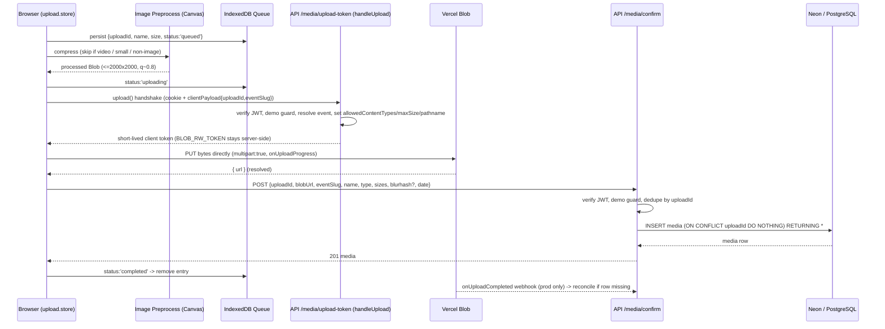
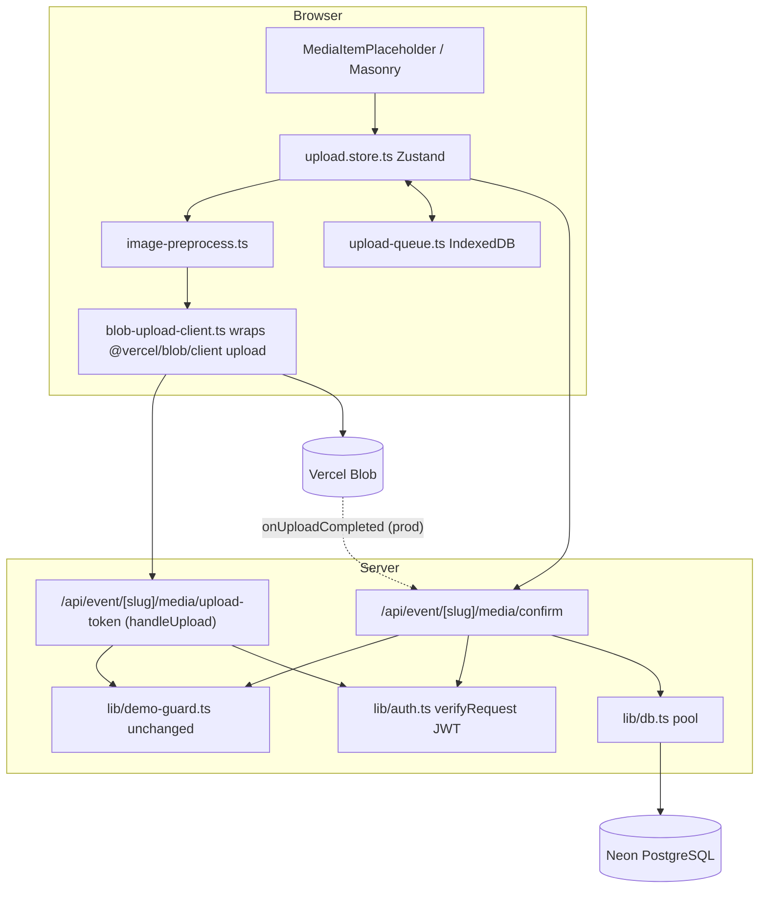

# Design Document: Upload & Media Architecture

## Overview

This design reworks how `golden-core` (a Next.js App Router gallery app) uploads media and loads it back for display. Today, every file is streamed through a Next.js Route Handler (`POST /api/event/[event-slug]/media`), which buffers the whole file in server memory, generates a BlurHash and reads EXIF with `sharp`/`exifr`, then calls `put()` and inserts a `media` row. This funnels large videos through the serverless function (subject to a 60s `maxDuration` and body-size limits), performs no client-side compression, has no persistent upload queue, and has no duplicate protection.

The new architecture moves the file bytes off the server. The browser compresses images client-side, then uploads **directly to Vercel Blob** using the official `@vercel/blob/client` `upload()` helper with `multipart: true`. The server's only role in the byte path is an **authenticated token handshake** (`handleUpload` in a Route Handler): it verifies the JWT, enforces demo restrictions, resolves the event, and constrains content type / size / pathname before Vercel Blob issues a short-lived client token. `BLOB_READ_WRITE_TOKEN` never leaves the server. After the browser upload resolves, the client calls a **confirm endpoint** that creates the `media` row (the reliable primary path, since Vercel's `onUploadCompleted` callback does not fire on localhost and is best treated as reconciliation, not the source of truth).

The design is scoped to be additive and reversible: the existing `POST .../media` route and its demo guard stay in place until the new path is proven, existing authorization checks are preserved verbatim, and no schema migration is written until the (already-inspected) schema is confirmed. It is structured to be implemented in phases (Phase 1 audit through Phase 8 build/verify).

---

## Phase 1: Architecture Audit (Findings)

The following was read directly from the codebase before any design decisions were made.

### 1.1 Current upload flow

- Entry point: `app/src/stores/upload.store.ts` (`useUploadStore`). `enqueueFiles()` creates `UploadItem`s (id via `crypto.randomUUID()`, `previewUrl` via `URL.createObjectURL`), switches global UI to `myPhotos`, and `processQueue()` runs at most **3 concurrent** uploads.
- Transport: `app/upload-xhr.ts` `uploadFile()` uses `XMLHttpRequest` (for `upload.onprogress`), `POST`s `multipart/form-data` with `file` + `date` to `/api/event/{slug}/media`. Timeouts: **30s images / 120s videos**.
- Retry: `retryItem()` re-runs the XHR, cap **3 retries** then `exhausted`. Progress mirrored into per-item Zustand state.
- On success the store mutates `useEventStore` to append the returned `Media` into the matching section.

### 1.2 Current Vercel Blob flow

- Server-side only. `app/api/event/[event-slug]/media/route.ts` calls `put(file.name, file, { access: "public", contentType })`. Deletion uses `del(blobUrls)` in `media/bulk/route.ts` (best-effort, errors swallowed).
- No `addRandomSuffix`, so `put()` uses the raw filename as pathname — collision risk across users/events.
- `@vercel/blob` is `^2.3.1`. No client-upload usage exists yet.

### 1.3 Where media rows are created in PostgreSQL

- Only in `POST .../media`: `INSERT INTO media (content, type, date, user_id, section_id, event_id, blurhash) ... RETURNING *`. Blob upload and DB insert are sequential and **not reconciled** — a crash after `put()` but before `INSERT` leaves an orphaned Blob; an insert with a bad Blob URL leaves an orphaned row.
- `me/event/[event-slug]/media` routes are stubs returning `501`.

### 1.4 Current image/video handling

- Extension + MIME sniffing via `VIDEO_EXTENSIONS` / `IMAGE_EXTENSIONS` sets; `MAX_FILE_SIZE = 100MB`.
- Images: magic-byte validation (`validateImageMagicBytes`), server BlurHash via `sharp` (`lib/blurhash.ts`, resize 32×32 → `encode(...,4,3)`), EXIF time via `exifr` used to auto-assign a section.
- No client-side compression anywhere — originals are uploaded.

### 1.5 Current upload UI/state (Zustand `upload.store.ts`)

- In-memory only. No persistence — a refresh loses the queue and any in-flight upload. State fields: `status` (`queued|uploading|success|failed|exhausted`), `progress`, `retryCount`, `error`, `mediaResult`.
- No `processing` state, no cancel, no original-vs-processed size tracking, no correlation id beyond the local `id`.

### 1.6 Current media rendering (`media-item.tsx`, `masonry.tsx`)

- `masonry.tsx`: two-column flex layout; renders upload placeholders (`MediaItemPlaceholder`) then `MediaItem`s. Splits media by even/odd index.
- `media-item.tsx`: images use `next/image` with `width={0} height={0} sizes="50vw"`, `loading="lazy"`, opacity transition on `onLoad`. **No `priority`** anywhere — the first images are lazy like the rest. Videos use a raw `<video preload="metadata">`.
- `next.config` was not found in the audited set; `next/image` remote patterns for the Blob domain must be confirmed in Phase 2.

### 1.7 Existing BlurHash implementation (`blurhash-canvas.tsx`)

- `lib/blurhash.ts` generates server-side during upload (blocks the request while `sharp` runs). Column `blurhash VARCHAR(100)` added via `migrations/add-blurhash-column.sql`.
- `blurhash-canvas.tsx` decodes to a 32×32 `<canvas>` in a `useEffect`; shown only while `!loaded`. Correct but re-decodes whenever `blurhash/width/height` change; `MediaItem` shows canvas absolutely positioned under the image.

### 1.8 Existing authentication/authorization around uploads

- JWT in `auth_token` httpOnly cookie (`sameSite: lax`, 3-day expiry). Payload (`app/utils/jwt.ts`): `{ userId, email, isAdmin }`. Verified with `jwt.verify(token, JWT_SECRET)` in each route.
- Demo guard (`lib/demo-guard.ts`): `isDemoEvent(slug) === (slug === "demo")`, `isDemoUser(email) === (email === "demo@golden-core.app")`, `demoGuardResponse()` → `403`. Every mutating media route calls `if (isDemoEvent(eventSlug)) return demoGuardResponse()` at the top.
- `app/api/demo/auth/route.ts` issues a JWT for the demo user.

### 1.9 Schema reality check (important inconsistency)

- `schema.sql` defines `media` with columns `media_id, user_id, content, media_type, date, section_id, event_id` and a `media_type CHECK ('image'|'video')` — **no `type` or `blurhash` column**.
- Migrations add `media_type` (`001_...`) and `blurhash` (`add-blurhash-column.sql`).
- The **running code** inserts/reads `content, type, date, user_id, section_id, event_id, blurhash` and the `Media` DTO uses `type`, `blurhash`, `likes`, `liked`, `username`.
- **Conclusion:** the live DB has diverged from `schema.sql` (it clearly has a `type` column and `blurhash`, and computes `likes`/`liked`/`username` via joins). Any new DB change MUST be validated against the **live** database, not `schema.sql`. This design proposes verifying the live columns in Phase 2 before writing a migration.

### 1.10 Dependencies present (no new byte-path deps required)

`@vercel/blob ^2.3.1`, `blurhash`, `sharp`, `exifr`, `uuid`, `axios`, `zustand ^5`, `pg`, `jsonwebtoken`, `bcrypt`. **Not present:** `browser-image-compression`, and (correctly) no `tus-js-client`/`uppy`.

---

## Proposed High-Level Architecture

### Upload flow (image example)



### Component map



### Key architectural decisions

- **D1 — Client confirm is the source of truth, not `onUploadCompleted`.** Verified from Vercel docs: `onUploadCompleted` does not fire against `localhost` (requires a tunnel). Relying on it alone would break local dev and add latency. The browser calls `POST .../media/confirm` after `upload()` resolves. `onUploadCompleted` (prod) is a **reconciliation** path that inserts the row only if it is still missing (idempotent via `uploadId`).
- **D2 — `multipart: true` for all client uploads.** The SDK splits the file, uploads parts in parallel, and **retries failed parts** automatically (verified). This satisfies the "retry parts" requirement for video without a custom protocol and without tus/uppy.
- **D3 — Correlation id = client-generated `uploadId` (UUID v4).** Flows through `clientPayload` (handshake) → Blob pathname → confirm body → a new unique DB column. This is the backbone of duplicate protection and orphan reconciliation.
- **D4 — Honest resumability (AMENDED, Change 3).** Vercel Blob client uploads are **not resumable across a page reload** — the multipart *byte stream* session lives in the in-memory `upload()` call and cannot be resumed mid-stream. That remains true. What is revised is the earlier blanket "never persist bytes" decision:
  - **Resumable images (image AND size ≤ `RESUMABLE_MAX_BYTES`, default 20 MB):** the actual upload bytes ARE persisted in a **separate IndexedDB object store** (never on the metadata record). On reload the item is **transparently auto-resumed** — a brand-new `upload()` reusing the SAME `uploadId`, shown as a VISIBLE progress placeholder, requiring no reselect. Because the `uploadId` is reused and the DB unique index enforces one row per `uploadId`, a duplicate row can never be created. Auto-resume is a fresh upload of the persisted bytes, NOT a resume of the in-flight multipart stream.
  - **A Blob already exists (has `blobUrl`):** recovery is a **silent confirm-only** call (idempotent by `uploadId`); on failure it surfaces a preview + tap-to-retry item (never a silent drop).
  - **Videos and oversized images:** bytes are NOT persisted; only a small preview **thumbnail** (data URL) is stored so recovery surfaces an inert item with the thumbnail and a **dismissable warning**. The user reselects to upload again (reusing the `uploadId` if they act on the surfaced item).
  - **Mandatory cleanup:** persisted bytes are deleted on every terminal outcome (confirm success, cancel, dismiss), leaving no orphaned bytes. Byte persistence is best-effort (IndexedDB-unavailable ⇒ no-op; the upload still works, just without cross-reload auto-resume).
  This is stated plainly: no cross-reload resume of the Blob multipart *stream* is promised; auto-resume is a re-upload of persisted bytes under the same `uploadId`.
- **D5 — Adapt, don't duplicate.** No second "upload" endpoint with overlapping responsibility: the legacy `POST .../media` stays for backward compatibility during rollout; the two new sibling routes (`upload-token`, `confirm`) are distinct responsibilities, not duplicates. Both new routes reuse the exact same JWT + demo-guard checks.

---

## Components and Interfaces

### Component 1: `lib/auth.ts` (new, extracted)

**Purpose**: Centralize the JWT verification that is currently copy-pasted across routes so the new routes enforce identical rules. Does not change the auth/session flow.

```typescript
export interface AuthedUser {
  userId: number;
  email: string;
  isAdmin: boolean;
}

// Returns the decoded user or a Response to short-circuit with (401/500).
export function verifyRequest(request: NextRequest):
  | { ok: true; user: AuthedUser }
  | { ok: false; response: Response };
```

**Responsibilities**: read `auth_token` cookie, check `JWT_SECRET`, `jwt.verify`, map to `AuthedUser`. Never widens permissions beyond the existing behavior.

### Component 2: `POST /api/event/[event-slug]/media/upload-token` (new — `handleUpload`)

**Purpose**: The authenticated handshake. Verifies the user and constraints, then lets Vercel Blob mint a short-lived client token.

```typescript
import { handleUpload, type HandleUploadBody } from '@vercel/blob/client';

// Body shape sent by the client `upload()` handshake, plus completion pings.
export async function POST(request: NextRequest,
  { params }: { params: Promise<{ 'event-slug': string }> }): Promise<Response>;
```

**Responsibilities**:
- `if (isDemoEvent(eventSlug)) return demoGuardResponse();` **before** anything else.
- `verifyRequest(request)`; also reject if `isDemoUser(user.email)` for this path (defense in depth).
- Parse `clientPayload` → `{ uploadId, eventSlug, filename, contentType, size }`; validate `uploadId` is a UUID and `eventSlug` matches the route param.
- Resolve `event_id` from slug (404 if missing); confirm the user is allowed to upload to that event.
- Return from `onBeforeGenerateToken`: `allowedContentTypes` (image/* + the accepted video types), `maximumSizeInBytes` (100MB, matching current limit), `addRandomSuffix: true`, a namespaced `pathname` (`events/{eventId}/{uploadId}/{safeName}`), and `tokenPayload` carrying `{ uploadId, userId, eventId }`.
- `onUploadCompleted`: reconciliation only (see D1) — idempotent insert keyed by `uploadId`.

### Component 3: `POST /api/event/[event-slug]/media/confirm` (new)

**Purpose**: Primary media-row creation after the browser upload resolves. Idempotent and demo-guarded.

```typescript
export interface ConfirmUploadBody {
  uploadId: string;          // UUID, correlation id
  blobUrl: string;           // returned by upload()
  filename: string;
  contentType: string;       // resolved MIME
  originalSize: number;
  processedSize: number;
  date: string;              // ISO, as today
  blurhash?: string | null;  // optional client-provided; server may (re)generate
}
export async function POST(request: NextRequest,
  { params }: { params: Promise<{ 'event-slug': string }> }): Promise<Response>;
```

**Responsibilities**: demo guard → `verifyRequest` → validate `blobUrl` belongs to this event's Blob prefix → resolve section (reuse existing photo-time logic) → **idempotent insert** keyed by `uploadId`. If a row already exists for `uploadId`, return it (200) instead of inserting a duplicate. On DB failure after a successful Blob upload, best-effort `del(blobUrl)` to avoid an orphaned Blob, then return 500.

**Response shape (Change 1)**: both the 201 (created) and 200 (existing) responses return the row **shaped as the Media DTO** the gallery consumes — `{ media_id, user_id, content, likes, liked, date, type, section_id, blurhash, username }` — mirroring exactly what `GET /api/event/[event-slug]` emits per media. A raw `INSERT ... RETURNING *` row lacks `username`/`likes`/`liked`; the endpoint resolves those via one `SELECT ... FROM users LEFT JOIN likes ...` (a new row naturally has 0 likes / `liked = false`). This lets the Upload_Store append the response directly into the event store so freshly uploaded media renders live (correct `username`, likes, and the `user_id === me` "myPhotos" filter) without a refresh.

### Component 4: `lib/image-preprocess.ts` (new, client)

**Purpose**: Client-side image compression using the Canvas API (no new dependency required).

```typescript
export interface PreprocessResult {
  blob: Blob;          // processed (or original if skipped)
  processed: boolean;  // false when skipped
  width: number;
  height: number;
}
export interface PreprocessOptions {
  maxEdge?: number;    // default 2000
  quality?: number;    // default 0.8
  minSkipBytes?: number; // skip if smaller, default ~200KB
}
export async function preprocessImage(file: File, opts?: PreprocessOptions): Promise<PreprocessResult>;
```

**Responsibilities**: skip videos and non-images (return original untouched); skip small images; otherwise draw to a canvas capped at `maxEdge`×`maxEdge` preserving aspect ratio and EXIF orientation (`createImageBitmap(file, { imageOrientation: 'from-image' })`), export via `canvas.toBlob(type, quality)`. If output is larger than input, keep the original.

> If pure-Canvas orientation/quality proves insufficient in practice, `browser-image-compression` is the sanctioned fallback dependency (dep decision deferred to implementation; see Dependencies). tus/uppy remain excluded.

### Component 5: `lib/upload-queue.ts` (new, client — IndexedDB)

**Purpose**: Persistent queue metadata (not bytes; not localStorage) for crash/reload recovery.

```typescript
export type QueueStatus = 'queued' | 'processing' | 'uploading' | 'completed' | 'failed';
export interface QueueRecord {
  uploadId: string;      // primary key
  eventSlug: string;
  filename: string;
  contentType: string;
  originalSize: number;
  processedSize: number | null;
  status: QueueStatus;
  blobUrl: string | null; // set once upload() resolves, before confirm
  error: string | null;
  date: string;          // ISO-8601, enqueue-time upload-intent timestamp; reused by
                         // confirm-only recovery as the media `date`; distinct from updatedAt
  updatedAt: number;
  // Optional recovery-UX metadata (Change 3; back-compat / optional).
  blurhash?: string | null;       // client BlurHash, reused by recovery confirm bodies
  kind?: 'image' | 'video';       // classification for recovery branch selection
  hasBytes?: boolean;             // true when upload bytes were persisted (resumable image)
  oversized?: boolean;            // true for an image over RESUMABLE_MAX_BYTES
  thumbnailDataUrl?: string | null; // preview for no-bytes records (video/oversized)
}
export const uploadQueue: {
  put(rec: QueueRecord): Promise<void>;
  patch(uploadId: string, partial: Partial<QueueRecord>): Promise<void>;
  remove(uploadId: string): Promise<void>; // removes metadata record AND persisted bytes
  all(): Promise<QueueRecord[]>;
  // Change 3: separate bytes store (resumable images only).
  putBytes(uploadId: string, blob: Blob): Promise<void>;
  getBytes(uploadId: string): Promise<Blob | null>;
  removeBytes(uploadId: string): Promise<void>;
};
```

**Responsibilities**: TWO IndexedDB object stores, both keyed by `uploadId` — a `uploads` **metadata** store (never contains file bytes) and a separate `upload-bytes` store (Change 3) holding the actual bytes for resumable images (≤ `RESUMABLE_MAX_BYTES`) so `all()` stays cheap. On app start, `all()` surfaces interrupted records. The persisted `date` (the ISO-8601 upload-intent timestamp captured at enqueue, distinct from `updatedAt`) is written once at enqueue and never modified on later transitions, so confirm-only recovery can rebuild the confirm body's `date` from persisted metadata rather than fabricating one. Recovery branches: `blobUrl`-set ⇒ silent confirm (not a re-upload) since the Blob already exists — still idempotent by `uploadId`; no `blobUrl` + persisted bytes (resumable image) ⇒ transparent auto-resume reusing the same `uploadId`; no `blobUrl` + no bytes (video/oversized) ⇒ surface an inert item with the persisted `thumbnailDataUrl` and a dismissable warning. `remove()` and every terminal outcome delete the persisted bytes (mandatory cleanup). Byte persistence is best-effort (IndexedDB-unavailable ⇒ no-op).

### Component 6: `blob-upload-client.ts` (new, client)

**Purpose**: Thin wrapper over `@vercel/blob/client` `upload()`.

```typescript
import { upload } from '@vercel/blob/client';

export interface ClientUploadArgs {
  uploadId: string;
  eventSlug: string;
  pathname: string;      // filename part; server namespaces it
  body: Blob;
  contentType: string;
  onProgress: (pct: number) => void;
  signal?: AbortSignal;  // cancel support
}
export async function clientUpload(args: ClientUploadArgs): Promise<{ url: string }>;
```

Calls `upload(pathname, body, { access: 'public', handleUploadUrl: '/api/event/{slug}/media/upload-token', clientPayload: JSON.stringify({...}), multipart: true, contentType, onUploadProgress: ({percentage}) => onProgress(percentage), abortSignal: signal })`.

### Component 7: `upload.store.ts` (refactor of existing)

**Purpose**: Orchestrate preprocess → handshake → Blob upload → confirm, with isolated state and minimal re-renders.

```typescript
export type UploadStatus = 'queued' | 'processing' | 'uploading' | 'completed' | 'failed' | 'canceled';
export interface UploadItem {
  id: string;              // == uploadId
  file: File;
  previewUrl: string;
  status: UploadStatus;
  progress: number;        // 0-100
  originalSize: number;
  processedSize: number | null;
  contentType: string;
  retryCount: number;
  error: string | null;
  abort: AbortController | null;
  mediaResult: Media | null;
}
export interface UploadStore {
  items: UploadItem[];
  activeCount: number;
  enqueueFiles(files: File[], eventSlug: string): Promise<void>;
  retryItem(id: string): void;
  cancelItem(id: string): void;   // NEW: aborts in-flight upload
  dismissItem(id: string): void;
  recoverInterrupted(eventSlug: string): Promise<void>; // NEW: from IndexedDB
}
```

**Responsibilities**: keep upload state isolated in this store (as today); use selector-based subscriptions in components so a single item's progress does not re-render the whole list; drive the IndexedDB queue in lockstep with in-memory state; enforce concurrency (keep the current cap of 3).

---

## Data Models

### `Media` DTO (unchanged shape, source of truth for the client)

```typescript
export interface Media {
  media_id: number;
  user_id: number;
  content: string;         // Blob public URL
  type: string | null;     // MIME
  likes: number;
  liked: boolean;
  date: string;
  section_id: number | null;
  blurhash: string | null;
  username: string | null;
}
```

### `media` table — proposed change (pending live-schema verification)

Add a nullable, unique correlation column so duplicate protection and reconciliation are enforced by the database, not just app logic. **Do not create the migration until the live DB columns are confirmed in Phase 2** (see Finding 1.9).

```sql
-- Proposed (Phase 2, only after verifying live columns):
ALTER TABLE public.media ADD COLUMN upload_id UUID;
CREATE UNIQUE INDEX media_upload_id_key ON public.media (upload_id) WHERE upload_id IS NOT NULL;
```

**Validation rules**:
- `upload_id` is nullable so historical rows (no correlation id) remain valid.
- Partial unique index means at most one row per `upload_id`, which makes `ON CONFLICT (upload_id) DO NOTHING` the atomic dedupe primitive shared by `confirm` and `onUploadCompleted`.
- `content` (Blob URL) must start with the event's Blob prefix, checked in `confirm`.

---

## Algorithmic Pseudocode

### Confirm handler (idempotent media-row creation)

```typescript
async function confirmUpload(request, eventSlug): Promise<Response> {
  // Preconditions: request may or may not be authenticated; eventSlug from route.
  if (isDemoEvent(eventSlug)) return demoGuardResponse();          // demo: hard stop

  const auth = verifyRequest(request);
  if (!auth.ok) return auth.response;                              // 401/500
  if (isDemoUser(auth.user.email)) return demoGuardResponse();     // defense in depth

  const body = parseConfirmBody(request);                          // 400 on malformed
  if (!isUuid(body.uploadId)) return badRequest('invalid uploadId');

  const event = await findEventBySlug(eventSlug);                  // 404 if missing
  if (!blobUrlBelongsToEvent(body.blobUrl, event.event_id)) return badRequest('blob/event mismatch');

  const sectionId = await resolveSection(event.event_id, body /* photo time */);

  try {
    // ON CONFLICT makes this safe under retries and the reconciliation webhook.
    const row = await insertMediaIdempotent({
      uploadId: body.uploadId, content: body.blobUrl, type: body.contentType,
      date: body.date, userId: auth.user.userId, sectionId, eventId: event.event_id,
      blurhash: body.blurhash ?? null,
    });
    return json(row, row.__inserted ? 201 : 200);
  } catch (dbError) {
    await bestEffortDeleteBlob(body.blobUrl);                      // avoid orphaned Blob
    return serverError('Could not save media');                    // no internal details leaked
  }
}
```

**Preconditions**: `blobUrl` points to an already-uploaded Blob; `uploadId` is the same id used at handshake time.
**Postconditions**: exactly one `media` row exists for `uploadId` (created here or already present); on DB failure the Blob is deleted (no orphan) and no row exists.
**Loop invariants**: N/A (no loops).

### Client orchestration for one file

```typescript
async function processOne(item: UploadItem, eventSlug: string) {
  await uploadQueue.put(toRecord(item, 'queued'));

  // Preprocess (images only)
  setStatus(item.id, 'processing');
  const pre = await preprocessImage(item.file);          // videos/small/non-image => original
  patchSizes(item.id, item.file.size, pre.blob.size);
  await uploadQueue.patch(item.id, { status: 'uploading', processedSize: pre.blob.size });

  // Direct-to-Blob upload with multipart + progress + cancel
  setStatus(item.id, 'uploading');
  let url: string;
  try {
    ({ url } = await clientUpload({
      uploadId: item.id, eventSlug, pathname: safeName(item.file.name),
      body: pre.blob, contentType: item.contentType,
      onProgress: pct => setProgress(item.id, pct),
      signal: item.abort!.signal,
    }));
  } catch (e) {
    if (isAbort(e)) return finalize(item.id, 'canceled');
    await uploadQueue.patch(item.id, { status: 'failed', error: message(e) });
    return finalize(item.id, 'failed', message(e));       // no silent failure
  }
  await uploadQueue.patch(item.id, { status: 'uploading', blobUrl: url });

  // Confirm => DB row
  try {
    const media = await confirmUpload(eventSlug, buildConfirmBody(item, url, pre));
    appendMediaToEventStore(media);
    await uploadQueue.remove(item.id);
    finalize(item.id, 'completed', null, media);
  } catch (e) {
    await uploadQueue.patch(item.id, { status: 'failed', error: message(e) });
    finalize(item.id, 'failed', message(e));
  }
}
```

**Preconditions**: `item.abort` is a fresh `AbortController`; `eventSlug` is the current event.
**Postconditions**: on success a `Media` is appended to the event store and the queue entry is removed; on failure the queue entry is `failed` with a user-facing message; on cancel the entry is `canceled` and no confirm is sent.

### Recovery on app start

```typescript
async function recoverInterrupted(eventSlug: string) {           // AMENDED, Change 3
  const records = await uploadQueue.all();
  for (const r of records.filter(r => r.eventSlug === eventSlug)) {
    if (r.status === 'completed') {
      // Already succeeded: drop the record + its bytes; never surface.
      await uploadQueue.remove(r.uploadId); continue;
    }
    const hasBlob = !!r.blobUrl;
    const hasDate = !!r.date;
    if (hasBlob && hasDate) {
      // Blob exists: SILENT confirm-only (idempotent by uploadId), body rebuilt
      // from persisted metadata + persisted enqueue-time `date` (never fabricated)
      // + persisted blurhash. On success append Media + remove record; on failure
      // surface a preview + tap-to-retry item (never a silent drop).
      autoConfirm(r);
    } else if (!hasBlob && r.hasBytes && r.kind === 'image') {
      // Resumable image with persisted bytes: TRANSPARENT auto-resume — recreate a
      // VISIBLE 'queued' placeholder for the SAME uploadId, load bytes via
      // getBytes, and drive it through the SAME attempt-guarded startItem/
      // processQueue machinery under MAX_CONCURRENT. No reselect; no new uploadId.
      autoResumeFromBytes(r);
    } else {
      // Video / oversized image (no bytes), or a legacy has-blob record with no
      // date: surface an INERT item with the persisted thumbnail + a dismissable
      // warning. No automatic action; uploadId preserved.
      surfaceInert(r);
    }
  }
}
```

**Postconditions**: no *silent* re-upload — a byte-persisted image auto-resumes VISIBLY (a progress placeholder) through the same attempt-guarded machinery, reusing `uploadId` (so duplicates/orphans are impossible); a record with a Blob is confirmed idempotently (never re-uploaded); bytes-less records (video/oversized, or a legacy no-date record) are surfaced with a thumbnail + dismissable warning. Confirm bodies use the persisted enqueue-time `date` and `blurhash` (never fabricated). Persisted bytes are deleted on confirm success / cancel / dismiss (no orphaned bytes).

---

## Key Functions with Formal Specifications

### `preprocessImage(file, opts)`

- **Preconditions**: `file` is a `File`; `opts.maxEdge > 0`, `0 < opts.quality <= 1`.
- **Postconditions**: returns original untouched when `file` is a video, non-image, below `minSkipBytes`, or when compression would enlarge it; otherwise returns a Blob with both dimensions `<= maxEdge`, EXIF orientation baked in, JPEG/WebP quality `~= quality`. Never mutates `file`.
- **Loop invariants**: N/A.

### `verifyRequest(request)`

- **Preconditions**: `request` has cookies accessible; `JWT_SECRET` set (else `{ok:false, 500}`).
- **Postconditions**: `{ok:true, user}` iff the cookie holds a valid unexpired JWT; otherwise `{ok:false, 401}`. No side effects, no permission widening.

### `insertMediaIdempotent(input)`

- **Preconditions**: `input.uploadId` is a UUID; referenced `event_id`/`section_id` exist.
- **Postconditions**: after return, exactly one `media` row exists for `uploadId`; sets `__inserted` to indicate create vs pre-existing. Concurrent calls with the same `uploadId` never create two rows (enforced by `media_upload_id_key`).

---

## Example Usage

```typescript
// Component: drop/select handler
const enqueue = useUploadStore(s => s.enqueueFiles);
await enqueue(Array.from(fileInput.files!), eventSlug);

// Cancel a single in-flight upload (new capability)
const cancel = useUploadStore(s => s.cancelItem);
cancel(uploadId);

// App bootstrap: offer recovery of interrupted uploads (honest, no auto-resume)
useEffect(() => { useUploadStore.getState().recoverInterrupted(eventSlug); }, [eventSlug]);

// Minimal re-render: subscribe to one item's progress only
const progress = useUploadStore(s => s.items.find(i => i.id === id)?.progress ?? 0);
```

---

## Correctness Properties

- **P1 (No duplicate rows)**: For all `uploadId`, `COUNT(media WHERE upload_id = uploadId) <= 1`, regardless of retries, reload-restarts, or the reconciliation webhook firing after `confirm`.
- **P2 (No orphaned rows)**: For every `media` row created by the new path, `content` references a Blob that existed at confirm time; a `confirm` that fails to insert deletes the Blob it was given.
- **P3 (No orphaned Blobs on the happy path)**: If `upload()` resolves, either a matching `media` row exists (via `confirm` or reconciliation) or the Blob was deleted after a DB failure.
- **P4 (Demo immutability)**: For every new entry point (`upload-token`, `confirm`, `onUploadCompleted`, retry, recovery), a request for the `demo` event OR from the demo user yields `403` and creates no Blob token and no `media` row.
- **P5 (Token secrecy)**: `BLOB_READ_WRITE_TOKEN` never appears in any client response or client bundle; the browser only ever holds short-lived client tokens.
- **P6 (Preprocess safety)**: Videos and non-images are byte-identical before and after `preprocessImage`. The input `File` is never mutated on any path (processed, never-enlarge, skip, or failure). (Change 2 note: `preprocessImage` also returns a NON-BLOCKING client BlurHash computed from the same decoded pixels; it never throws and returns `null` on any failure or for videos/non-images/skipped images — this does not affect P6, which is about input bytes, not the returned hash.)
- **P7 (No silent errors)**: Every failure path sets an `error` message on the item/queue record and a user-facing status; nothing is swallowed. (Change 3 note: a failed auto-confirm surfaces a preview + tap-to-retry item rather than dropping the record; auto-resume of persisted image bytes is VISIBLE and goes through the same attempt guard.)
- **P8 (Byte-persistence lifecycle, Change 3)**: File bytes are persisted ONLY for resumable images (image AND ≤ `RESUMABLE_MAX_BYTES`), ONLY in the separate `upload-bytes` store, and are DELETED on every terminal outcome (confirm success / cancel / dismiss). Videos and oversized images persist only a thumbnail (never bytes). Auto-resume reuses the SAME `uploadId`, so re-confirm dedupes (P1 upheld — no duplicate rows). Nothing is ever silently swallowed (P7 upheld).

---

## Error Handling

| Scenario | Detection | Response / Recovery |
|---|---|---|
| Network disconnect mid-upload | `upload()` rejects | item → `failed`, queue persisted, user can retry (new `upload()`, same `uploadId`) |
| Timeout / tab sleep / navigation | in-flight promise rejects or unmounts | queue record left `uploading`; recovery surfaces it on next load |
| Refresh during upload | page reload | `recoverInterrupted` surfaces record; restart or confirm-only, never duplicate |
| Blob upload failure | `upload()` rejects | `failed` + message; no `confirm` sent; no row |
| Multipart part failure | handled by SDK (`multipart:true` auto-retries parts) | transparent; only surfaces if all retries exhausted |
| DB insert failure at confirm | `insertMediaIdempotent` throws | best-effort `del(blobUrl)`, return 500 "Could not save media" (no internals) |
| Auth expiration | `verifyRequest` → 401 | client prompts re-auth; item `failed` with clear message |
| Authorization failure | event/user mismatch | 403; no token, no row |
| Demo restriction | `isDemoEvent`/`isDemoUser` | 403 `demoGuardResponse()`; no token, no row (P4) |
| Duplicate retry | same `uploadId` reaches confirm twice | `ON CONFLICT DO NOTHING`, returns existing row 200 (P1) |
| Unsupported type | `allowedContentTypes` (server) + client precheck | handshake rejects; client shows "Only images and videos" |
| File too large | `maximumSizeInBytes` (server) + client precheck | handshake rejects; client shows size-limit message |

No `console.log` debug residue; server errors return generic messages while logging details server-side only.

---

## Testing Strategy

### Unit
- `preprocessImage`: skip rules (video/non-image/small), max-edge clamp, orientation, "don't enlarge" rule (P6).
- `verifyRequest`: valid/expired/missing token, missing secret.
- `insertMediaIdempotent`: concurrent same-`uploadId` inserts produce one row (P1).
- `confirm`: demo/demo-user → 403 (P4); blob/event mismatch → 400; DB failure → Blob deleted (P2).

### Property-based
- **Library**: `fast-check` (JS/TS ecosystem; not currently a dep — add under devDependencies).
- P1: for arbitrary interleavings of {confirm, reconciliation, restart} over a set of `uploadId`s, row count per id `<= 1`.
- P4: for arbitrary route/method across the new entry points, a demo context always yields 403 and zero writes.
- P6: for arbitrary video/non-image inputs, output bytes equal input bytes.

### Integration
- Full path against a preview deployment (where `onUploadCompleted` fires) to prove reconciliation and that `confirm` + webhook don't double-insert.
- Local path proving `confirm` alone creates the row when the webhook can't reach `localhost`.

---

## Performance Considerations

- Originals are never uploaded (client compression) and large files never traverse the Next.js function (direct-to-Blob) — removes the 60s/body-size bottleneck (req 13).
- `next/image`: give **only the first ~2 gallery images** `priority`; all others `loading="lazy"`. Provide accurate `sizes` (two-column ⇒ `"(max-width: 768px) 50vw, 25vw"`) and set intrinsic `width`/`height` where known to cut layout shift. Confirm the Blob host is allowed in `next.config` `images.remotePatterns` (Phase 2).
- Minimize Zustand churn: selector-scoped subscriptions per item; batch progress updates (e.g., only emit on whole-percent change) to avoid re-rendering the masonry on every byte.
- Reuse existing section-resolution query; avoid redundant event/section lookups by resolving once per confirm.

## Security Considerations

- Handshake (`onBeforeGenerateToken`) authenticates the JWT and authorizes the event **before** any token is issued; sets `allowedContentTypes`, `maximumSizeInBytes`, and a server-controlled `pathname` (`events/{eventId}/{uploadId}/...` with `addRandomSuffix`). `BLOB_READ_WRITE_TOKEN` stays server-side (P5).
- Demo guard runs first on every new route; demo-user check added as defense in depth (P4).
- `confirm` validates that the Blob URL belongs to the resolved event's prefix, preventing a caller from attaching an arbitrary Blob URL to a `media` row.
- Keep the existing image magic-byte validation concept; since bytes no longer pass through the server, enforce type via `allowedContentTypes` at the handshake and validate the resolved MIME at confirm.

---

## Dependencies

**Reuse (no change to byte path)**: `@vercel/blob ^2.3.1` (`@vercel/blob/client` `upload` + `handleUpload`), `blurhash`, `sharp` (server BlurHash/reconciliation only), `exifr`, `uuid`, `zustand`, `pg`, `jsonwebtoken`.

**Possibly add (justified, decided in implementation)**:
- `fast-check` (devDependency) for the property tests above.
- `browser-image-compression` **only if** the Canvas approach proves insufficient for orientation/quality across target browsers; otherwise omit.

**Explicitly excluded**: `tus-js-client`, `uppy`, and any custom resumable protocol (per requirements).

**IndexedDB**: use the native API (small wrapper in `lib/upload-queue.ts`); no new dependency.

---

## Constraints (design-level, must hold through implementation)

- Do not rewrite unrelated architecture; keep the legacy `POST .../media` route until the new path is verified, then remove it in a dedicated step.
- Do not touch the auth/demo **session** flow; `lib/auth.ts` only *extracts* existing verification logic, it does not change it.
- Do not remove or weaken any existing authorization or demo checks; the new routes replicate them.
- Do not create duplicate upload endpoints with overlapping responsibility; the two new routes are distinct (token handshake vs. DB confirm).
- Do not create a migration until the **live** DB columns are verified (Finding 1.9); `schema.sql` is known to be stale.
- Do not assume any Vercel Blob feature that is not verified against the official docs (client `upload`, `multipart`, `onUploadProgress`, `handleUpload`, and the localhost `onUploadCompleted` limitation are all verified in this design).
- No arbitrary `sleep`/`setTimeout` for synchronization; rely on promise resolution, `ON CONFLICT`, and the unique index.
- No hidden/swallowed errors; no leftover debug `console.log` in shipped code.

## Suggested Implementation Phasing

- **Phase 2**: Verify live `media` columns + `next.config` image remotePatterns; add `lib/auth.ts`; write migration for `upload_id` (if confirmed).
- **Phase 3**: `upload-token` route (`handleUpload`) with full auth + demo guard + constraints.
- **Phase 4**: `confirm` route with idempotent insert + orphan cleanup.
- **Phase 5**: `image-preprocess.ts` + `blob-upload-client.ts`.
- **Phase 6**: `upload-queue.ts` (IndexedDB) + `upload.store.ts` refactor (cancel, recovery, isolated state).
- **Phase 7**: Media rendering polish (priority for first ~2, `sizes`, BlurHash transition; no regen per render).
- **Phase 8**: Tests (unit + `fast-check` properties + integration on preview), remove legacy route, cleanup.
